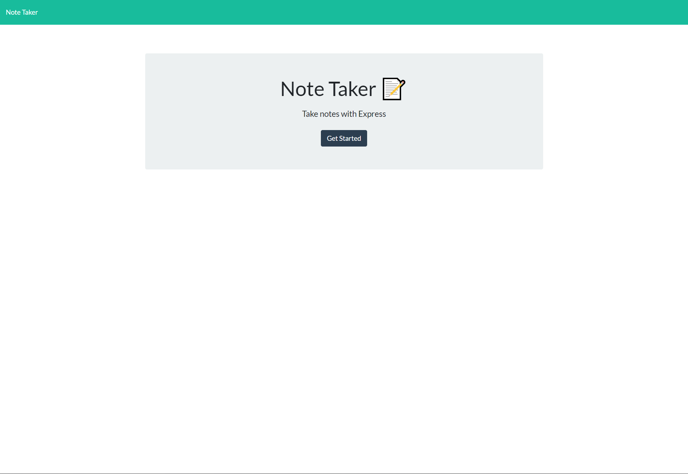
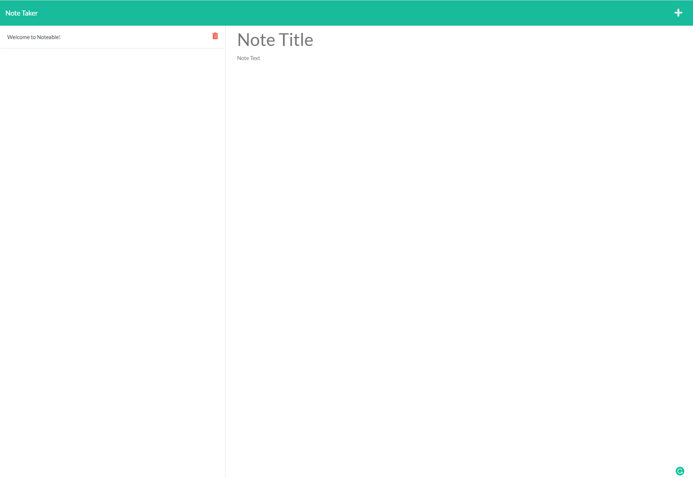

# Team Profile Generator


---

## Table of Contents

- [Description](#description)
- [Installation](#installation)
- [User-Interface]
- [Contributing](#contributing)
- [Tests](#tests)
- [Questions](#questions)
- [License](#license)
- [credits](#credits)

---

## Description

Creates and lists notes within the application for users to use for daily tasks or for other note taking purposes.

---

## Installation

No installation is required for to use this application, click on this following link 

---

## User-Interface

This the U/I of the the homepage of noteable application



This the U/I of the note-taking page, where the notes are inputed, saved and deleted



---

## Contributing

To contribute to this repository or the noteable project, adhere to the following MIT licensing requirments and proceed to clone the repository through the following manner;

```
HTTPS
git clone https://github.com/gurtej154/Noteable-project.git

or

SSH
git clone git@github.com:gurtej154/Noteable-project.git
```

---

## Tests

Tests were conducted through isomina, with all errors detected and resolved.

---

## Questions

Any questions regarding the project and the repository itself, please reach out via gurtej154@gmail.com. You can also checkout of my [Github Profile](https://github.com/gurtej154).

---

## License

This repository is licensed under [MIT License](LICENSE)

---

## Credits

N/A
